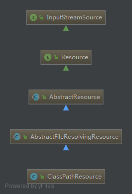

```java
Resource resource = new ClassPathResource("applicationContext.xml");
```

调用 ClassPathResource 类的构造方法，ClassPathResource  内部帮我们做了很多繁琐的工作。首先看下 ClassPathResource  类的继承关系：



```java
public class ClassPathResource extends AbstractFileResolvingResource {

   private final String path;

   @Nullable
   private ClassLoader classLoader;

   @Nullable
   private Class<?> clazz;
   
   ...
}   
```

ClassPathResource 类内部 定义了 final 类型的变量path，用于存储构造方法传入的path参数。


```java
public ClassPathResource(String path) {
   this(path, (ClassLoader) null);
}
```

第一次看到 this(path, (ClassLoader) null); 这行代码的时候，有点懵的，一般我们调用重载的构造方法时


```java
public ClassPathResource(String path, @Nullable ClassLoader classLoader) {
   Assert.notNull(path, "Path must not be null");
   String pathToUse = StringUtils.cleanPath(path);
   if (pathToUse.startsWith("/")) {
      pathToUse = pathToUse.substring(1);
   }
   this.path = pathToUse;
   this.classLoader = (classLoader != null ? classLoader : ClassUtils.getDefaultClassLoader());
}
```


ClassUtils.getDefaultClassLoader() 使用 Spring 提供的工具类 ClassUtils 获取默认的类加载器。

```java
public static ClassLoader getDefaultClassLoader() {
   ClassLoader cl = null;
   try {
      cl = Thread.currentThread().getContextClassLoader();
   }
   catch (Throwable ex) {
      // Cannot access thread context ClassLoader - falling back...
   }
   if (cl == null) {
      // No thread context class loader -> use class loader of this class.
      cl = ClassUtils.class.getClassLoader();
      if (cl == null) {
         // getClassLoader() returning null indicates the bootstrap ClassLoader
         try {
            cl = ClassLoader.getSystemClassLoader();
         }
         catch (Throwable ex) {
            // Cannot access system ClassLoader - oh well, maybe the caller can live with null...
         }
      }
   }
   return cl;
}
```

首先获取线程上线文类加载器，如果获取失败，则获取加载 ClassUtils 类的类加载器，如果返回null（加载 ClassUtils 类的类加载器是启动类加载器），则获取系统类加载器。

至此，ClassPathResource 类的构造方法分析完毕。


