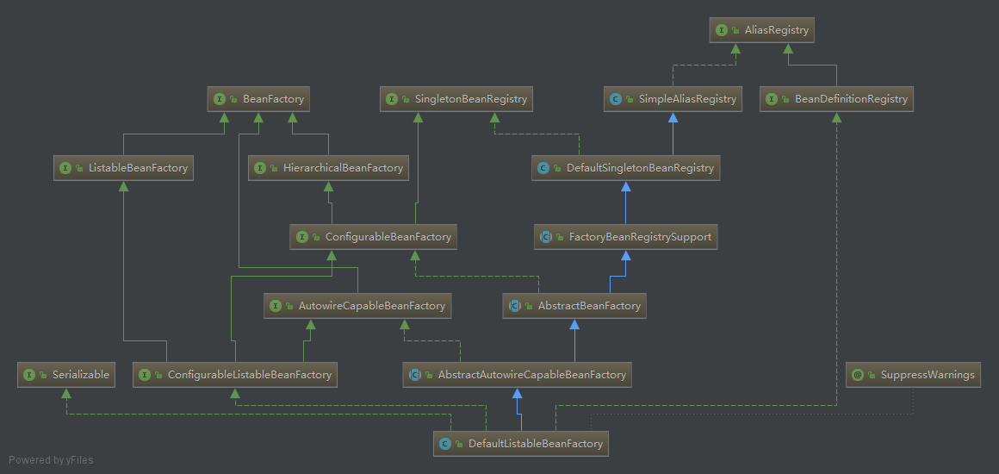

上篇文章我们分析了 ClassPathResource 对资源文件的封装。
```java
Resource resource = new ClassPathResource("applicationContext.xml");
```

接下来，我们继续往下分析，Spring中Bean工厂是如何创建的呢
我们这里是通过调用 DefaultListableBeanFactory 类的无参构造方法创建一个 BeanFactory 对象
```java
DefaultListableBeanFactory beanFactory = new DefaultListableBeanFactory();

```
DefaultListableBeanFactory 类的继承关系：



```java
/**
 * Create a new DefaultListableBeanFactory.
 */
public DefaultListableBeanFactory() {
    super();
}
```
DefaultListableBeanFactory 类通过 super() 方法调用了父类 AbstractAutowireCapableBeanFactory 的无参构造方法，继续跟踪 super()方法
```java
/**
 * Create a new AbstractAutowireCapableBeanFactory.
 */
public AbstractAutowireCapableBeanFactory() {
    super();
    ignoreDependencyInterface(BeanNameAware.class);
    ignoreDependencyInterface(BeanFactoryAware.class);
    ignoreDependencyInterface(BeanClassLoaderAware.class);
}
```
同样的，AbstractAutowireCapableBeanFactory 首先通过 super() 方法调用了父类 AbstractBeanFactory 的无参构造方法，
AbstractBeanFactory 类的构造方法空实现。
```java
/**
 * Create a new AbstractBeanFactory.
 */
public AbstractBeanFactory() {
}
```
接着连续调用了3次 ignoreDependencyInterface 方法
```java
/**
 * Ignore the given dependency interface for autowiring.
 * <p>This will typically be used by application contexts to register
 * dependencies that are resolved in other ways, like BeanFactory through
 * BeanFactoryAware or ApplicationContext through ApplicationContextAware.
 * <p>By default, only the BeanFactoryAware interface is ignored.
 * For further types to ignore, invoke this method for each type.
 * @see org.springframework.beans.factory.BeanFactoryAware
 * @see org.springframework.context.ApplicationContextAware
 */
public void ignoreDependencyInterface(Class<?> ifc) {
    this.ignoredDependencyInterfaces.add(ifc);
}
```
ignoreDependencyInterface() 方法实现非常简单，就是将参数ifc 添加到成员变量 ignoredDependencyInterfaces 集合中。
```java
/**
 * Dependency interfaces to ignore on dependency check and autowire, as Set of
 * Class objects. By default, only the BeanFactory interface is ignored.
 */
private final Set<Class<?>> ignoredDependencyInterfaces = new HashSet<>();
```

调用了3次 ignoreDependencyInterface() 方法分别将 BeanNameAware、BeanFactoryAware、BeanClassLoaderAware 
三个类的Class对象添加到成员变量 ignoredDependencyInterfaces 的 Set 集合中
至于Set 集合中的元素后面会在什么地方使用，后面文章会分析。

看下 ignoreDependencyInterface() 方法的注释，翻译下就是自动装配时忽略指定的依赖接口。看起来有点懵。
实际上是忽略该接口的实现类中和接口setter方法入参类型相同的依赖。
比如 Person类有个成员变量 `private User user`，Person 类实现了UserAware接口
```java
public interface UserAware {

    void setUser(User user);
}
```
Person 类中 setUser() 方法的实现
```java
import com.geekymv.spring.UserAware;

public class Person implements UserAware {

    private User user;

    @Override
    public void setUser(User user) {
        this.user = user;
    }

    public User getUser() {
        return user;
    }
}
```
如果我们调用了 beanFactory.ignoreDependencyInterface(UserAware.class); 方法忽略 UserAware 接口，
那么 Spring 就不会为 Person 类的 user 属性自动装配。


更多 ignoreDependencyInterface() 方法的使用请参考以下文章 
https://www.jianshu.com/p/3c7e0608ff1f
http://yangbolin.cn/2016/11/12/spring-work-01


以上就是调用 DefaultListableBeanFactory 类的无参构造方法来创建 BeanFactory 对象的全部内容。


